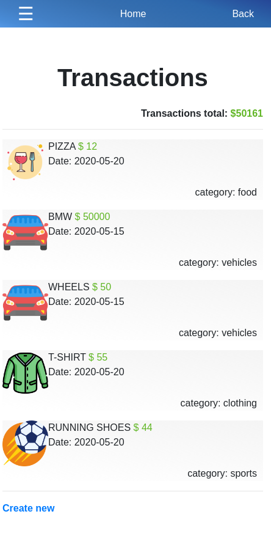

# Group our transactions

The project is based on an app for grouping transactions by category with your family/friends.
I am using amazon s3 with heroku for production. 


## Built With

- Ruby v2.6.5
- Ruby on Rails v5.2.4

## Live Demo
https://salty-sea-13355.herokuapp.com/
## Getting Started

To get a local copy up and running follow these simple example steps.

### Prerequisites

Ruby: 2.6.3
Rails: 5.2.3
Postgres: >=9.5

### Setup

Instal gems with:

```
bundle install
```

Setup database with:

```
   rails db:create
   rails db:migrate
```


### Usage

Start server with:

```
    rails server
```

Open `http://localhost:3000/` in your browser.

### Run tests

```
    rpsec --format documentation
```

### Deployment

TBA

## Author

👤 **Dannison Arias**

- Github: [@dannisonarias](https://github.com/dannisonarias)
- Twitter: [@AriasDannison](https://twitter.com/AriasDannison)
- Linkedin: [Dannison Arias](https://www.linkedin.com/in/dannison-arias-777919190/)

## 🤝 Contributing

Contributions, issues and feature requests are welcome!

Feel free to check the [issues page](issues/).

## Show your support

Give a ⭐️ if you like this project!

## Acknowledgments

- Microverse
- The Odin Project

## 📝 License

This project is [MIT](./license.md) licensed.